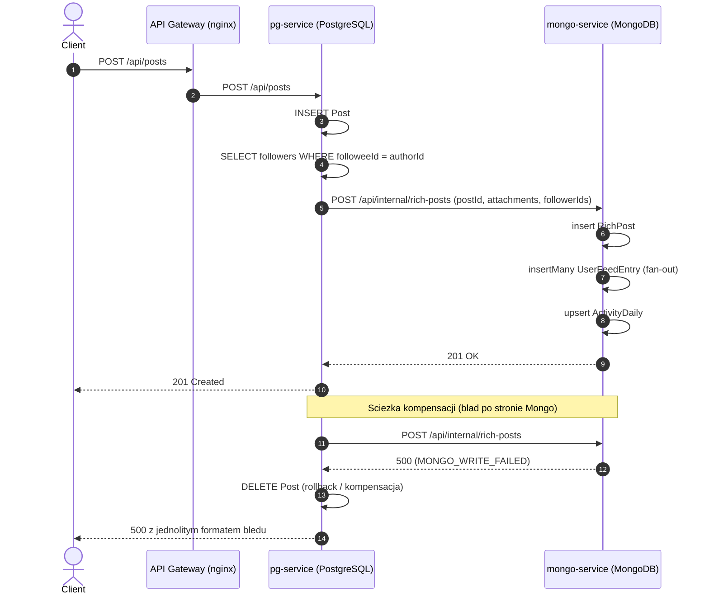
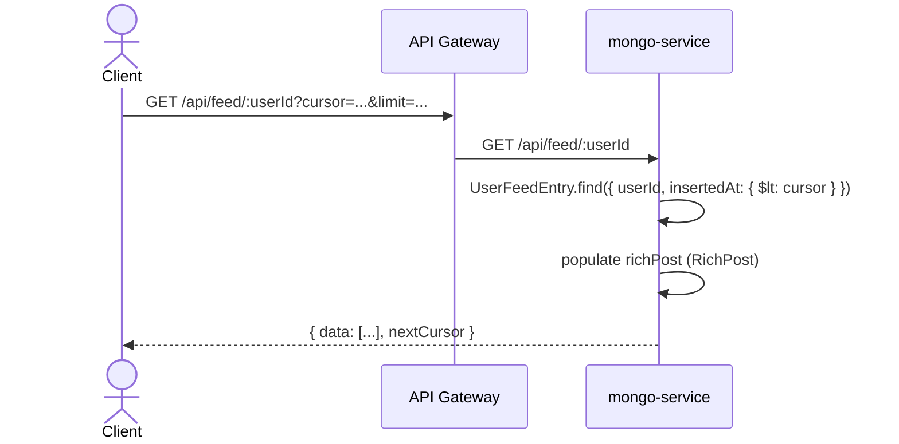

# Social Network Backend (Mikroserwisy: PostgreSQL + MongoDB)

## Uruchamianie Projektu

Projekt korzysta z Docker Compose do orkiestracji usług. Aby uruchomić projekt, przejdź do katalogu `backend/` i wykonaj komendę:

```bash
cd backend
docker-compose up -d --build
```

Spowoduje to uruchomienie wszystkich kontenerów ze zdefiniowanymi zmiennymi środowiskowymi oraz wykonanie migracji i seedowania bazy danych. Gateway będzie dostępny na odpowiednim porcie (zgodnie z konfiguracją).

## Zmienne Środowiskowe

Projekt wymaga m.in. sparametryzowania portów i kluczy połączeniowych do baz. W każdym z serwisów (lub z poziomu głównego `docker-compose.yml`) konfigurowane są zmienne w plikach `.env` (odpowiedniki `.env.example` można skopiować i dostosować):

* **PG-SERVICE**:
  * `PORT` – Port backendu relacyjnego (np. 3001)
  * `DATABASE_URL` – URL dla PostgreSQL (np. `postgresql://user:pass@db:5432/socialdb`)
* **MONGO-SERVICE**:
  * `PORT` – Port backendu dokumentowego (np. 3002)
  * `MONGO_URI` – URL dla bazy MongoDB (np. `mongodb://mongo:27017/social_network`)
* **API-GATEWAY**:
  * Zmienne sterujące trasowaniem i ewentualnym portem wejściowym całego systemu.

## Architektura i Podział Serwisów

Projekt oparty jest na architekturze mikroserwisowej podzielonej odpowiedzialnościami za typ bazy danych:

* **pg-service** (Baza: PostgreSQL): Serwis zarządzający wysoce relacyjnymi i kanonicznymi danymi — profilami użytkowników, obserwowaniem (follower/followee), podstawowymi rekordami postów, komentarzami. Odpowiada za integralność logiki biznesowej zachowując reguły ACID. Wewnątrz tego serwisu wykorzystywane są **cztery niezależne narzędzia** do PostgreSQL, zgodnie z wymaganiami T1-T4:
  * **`pg` (sterownik natywny)** — endpointy `/api/stats/*` (parametryzowane $1/$2, pula singleton, SIGINT graceful shutdown).
  * **`Knex.js`** — endpointy `/api/tags/*` (Query Builder z dynamicznym WHERE, dwie addytywne migracje + seed w `pg-service/knex/`).
  * **`Sequelize v6`** — endpointy `/api/notifications/*` (modele `Notification`, `NotificationType` z walidatorami niestandardowymi, hookiem `beforeCreate`, managed transaction, eager loading przez `include`).
  * **`Prisma`** — endpointy `/api/posts/*`, `/api/users/*` (główny ORM dla User/Post/Follow/Comment/Reaction, migracje w `prisma/migrations/`).
* **mongo-service** (Baza: MongoDB): Odpowiada za silnie zdenormalizowany model. Przechowuje feed (strumień aktywności użytkownika w postaci logu rozdzielonego podczas fan-out), obiekty bogate/rozszerzone takie jak embedy, a także agregacje (dzienne statystyki, top trendy).
* **api-gateway**: Reverse proxy (np. NGINX) obsługujący ruch zewnętrzny. Trasuje wywołania REST API odpowiednio do serwisu PG lub Mongo, bazując na schemacie ścieżek kontrolerów i endpointów.

## Przepływ Danych (PostgreSQL ↔ MongoDB)

Wysoka skalowalność odczytów (feedów) jest realizowana przez schemat "fan-out-on-write":
1. Zgłoszenie API nakazujące np. utworzenie nowej publikacji wpada początkowo do **pg-service** (`POST /posts`).
2. Transakcyjnie zapisywany jest nowy wiersz `Post` dla żądanego użytkownika na bazie Postgres.
3. System (poprzez wywołanie HTTP/brokera) zleca do **mongo-service** wykonanie pracy komplementującej (np. wzbogacenie danych wejściowych).
4. Następnie następuje rozproszenie referencji tego zdarzenia (wzorzec fan-out): wpis kopiowany jest kaskadowo do kolekcji feedów wszystkich aktualnie obserwujących (`user_feed_entries`), co pozwala klientowi pobrać zoptymalizowaną z góry pre-konstruowaną oś czasu z poziomu Mongo.
5. W systemie zaimplementowano odpowiednią strategię, reagującą na błędy: np. anulowanie zdarzenia w PG (kompensacja), jeśli aktualizacja po stronie Mongo zakończyła się krytycznym błędem przedwcześnie.

### Diagram sekwencji — tworzenie posta (fan-out + kompensacja)



### Diagram sekwencji — odczyt feedu



## Testy

Projekt ma dwa zestawy testów dla `pg-service`:

* **Testy jednostkowe / API z mockami** — `npm test` w `backend/pg-service/`. Nie wymagają działającej bazy, mockują Prisma Client (`jest.spyOn`).
* **Testy integracyjne z realnym PostgreSQL** — `npm run test:integration`. Wymagają działającego Postgresa pod adresem z `DATABASE_URL`, z zaaplikowanymi migracjami. Test czyści tabele przed/po, więc **należy je odpalać przeciwko testowej bazie**, nie produkcyjnej.

Zalecany sposób uruchomienia testów integracyjnych:

```bash
cd backend
docker-compose up -d postgres
cd pg-service
npx prisma migrate deploy
npm run test:integration
```

Domyślne `npm test` pomija testy z folderu `tests/integration/` przez flagę `RUN_INTEGRATION` (sterowanie przez `describe.skip`), więc CI bez bazy nadal przechodzi.

## Kwestie Bezpieczeństwa

W aplikacji zastosowano techniki obrony przed popularnymi zagrożeniami wektorowymi:
* **Brak walidacji wejścia**: Zastosowano globalne validatory, weryfikujące typ, rozmiar i struktury przesyłanych modeli (np. Zod, Joi, class-validator) przed skierowaniem ich do baz oraz limitujący długości ciągów znaków (np. treść postu).
* **Stack Trace Leak (Wycieki danych wewnętrznych systemu)**: Załadowano zcentralizowany mechanizm obsługi wyjątków (*errorHandler* w Express/Koa). Wszelkie błędy 500 nigdy nie wypluwają surowych struktur deweloperskich, stack-trace jest wycinany, klient dostaje tylko czysty JSON (np. `{ error, code, details }`).
* **SQL Injection & NoSQL Injection**: Całkowity zakaz klejenia SQLa z niewytyczonymi parametrami w locie. Wykorzystanie np. zapytań ze sterowników z pełną parametryzacją ($1, $2 w Prisma lub natywnych bibliotekach), a dla MongoDB sterylne zapytania filtrujące eliminujące ataki *Operator Injection*.
* **Limitacja Szybkości (Rate Limiting)**: Aplikacja zwraca stan HTTP `429 Too Many Requests`, jeśli pojedyncze proxy bije więcej niż X razy w przeciągu krótkiego okna na wybrane otwarte ścieżki (co mityguje ataki DoS/brute-force).